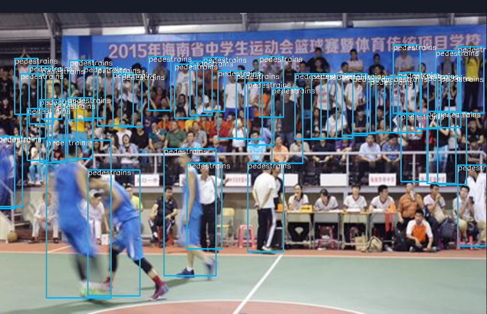

# WiderPerson2COCO

将WiderPerson转换为COCO格式的小工具

**main.py**: 生成COCO格式训练和验证的Annotation文件，形如：instance_xxx.json

```
'images': [
    {
        'file_name': 'xxxxxx.jpg',
        'height': xxx,
        'width': xxx,
        'id': xxxx
    },
    ...
],

'annotations': [
    {
        'area': xxx.x,
        'iscrowd': x,
        'image_id': xxx,
        'bbox': [xxx.x, xxx.x, xxx.x, xxx.x],
        'category_id': x,
        'id': xxxx
    },
    ...
],

'categories': [
    {
        'id': x, 
        'name': 'xxx'
    },
 ]
```


**post_processing.py**: 后处理，排除一些不要的类别，或转换一些类别到其他类别

**viz.py**: 可视化工具，指定image id绘制目标框


